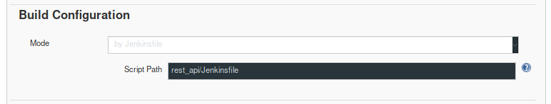

# How to set up our CI/CD environment
1. Start docker containers using docker-compose

2. Install Extra Plugins
   - SonarQube Scanner
   - Slack Notification Plugin

3. Setup Sonnar + Jenkins
   - On Sonarqube go to My Account -> Secutiry and generate a new token
   - On Jenkins go to Manage Jenkins -> Configure System -> SonarQube servers
   and add a new server. On the name insert the same as in the analysis stage of
   the Jenkinsfile. On the token field insert the token generated on the Sonarqube

4. Setup Slack + Jenking
   - Install the Jenkins app on to your workspace
   - Choose a channel to the app send messages
   - On Jenkings got o Manage Jenkins -> Configure System -> Global Slack Notifier
   Settings and fill the fields Base URL, Integration Token and Channel with the
   information provided on the Jenkins app page on Slack.
   - Still in Configure System go to Global Pipeline Libraries and add a new entry.
   Give it a name and choose the Retrieval method -> Modern SCM -> GitHub. On owner
   insert sorah and the repository choose the repository jenkinsfile-slack.
   - Insert `@Library('github.com/sorah/jenkinsfile-slack@master') _` to the top
   of your Jenkinsfile
   - Add the follwing to the pipeline on your Jenkinsfile
   ```
   post {
    always {
      postNotifySlack currentBuild.result
    }
   }
   ```

5. Build the pipeline agent image and **call it pipeline_agent**
    `docker build -t pipeline_agent pipeline_agent`

6. Setup the Jenkins Pipeline
    - On our project we used a multi-branch pipeline so we could test our builds
    for different branchs and pull requests.
    - On section "Branch Sources" we used Github and for behaviors we had
    "Discover branches" with strategy "Exclude branches that are also filed with PRs" and
    "Discover pull requests from origin" with strategy "Merging the pull request with the
    current target branch revision".
    

    - If your Jenkinsfile is not on the root folder of the project, like ours,
    on section "Build Configuration" select "by Jenkinsfile" and insert the
    relative path for the Jenkinsfile accordingly to the repository root.
    

